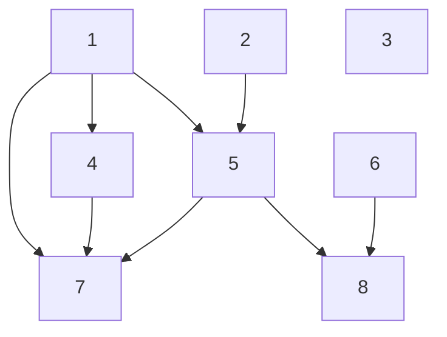
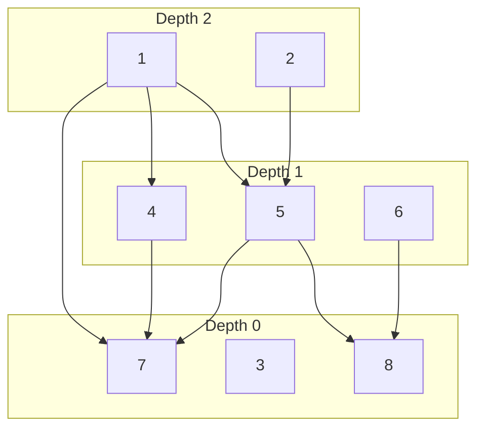

# Sequencer

- [Overview](#overview)
- [Limitations](#limitations)
- [Design](#design)
- [Ordering and Grouping](#ordering-and-grouping)

## Overview

The sequencer is a tool used to determine the order of steps to process
a set of items based on each items' dependencies.
This can group items together if they can all be processed in the same step.
This assumes there are no circular dependencies and will error if any
cycle is detected.

The sequencer _could_ be used to solve several problems[^1], such as:

- Ordering type initialization
- Ordering constant resolution
- Ordering packages for parallel parsing
- Explicit super-type determination to solidify implicit duck-typing
- Checking for cycles in dependencies

[^1]: We don't use the sequencer for all of those problems. Some are solved
with other tools and some are solutions we don't currently support. Several
of them would need an additional value tagging system added.

## Limitations

> [!IMPORTANT]
> The sequencer can only sequence a collection of items that do _not_ have
> dependency cycles.

<!---->
> [!WARNING]
> The sequencer can only sequence items that are
> [comparable](https://go.dev/ref/spec#Comparison_operators)
>
> Since the items are used a keys in the graph, the comparable parts
> of an item must not be modified after being added,
> since that could cause keying issues.

The sequencer does not:

- sort items in the groups, each group is randomly ordered
- provide any weighted or prioritized dependencies
- provide a tagging system for data propagation needed for problems like DCE
- allow removing items from the graph nor removing dependencies

## Design

The sequencer uses a type of
[DAG](https://en.wikipedia.org/wiki/Directed_acyclic_graph)
called a [polyforest](https://en.wikipedia.org/wiki/Polytree).
A polyforest is an acyclic forest were branches may have more than one parent
branch and those parents may be from the same or different trees.

The polyforest, like any graph, is made up of vertices and edges.
The vertices are the items being ordered and the directed edge starts from a
vertex, the parent, and ends on a vertex, child, dependent of that parent.
Each vertex may have zero or more parents and zero or more children.
Any vertex that has no children (other vertices depending on it) is a root.
Any vertex that has no parents (dependencies) is a leaf.
A vertex may be a leaf and root at the same time.
The graph flows from the root towards the leaves via child to parent.
There may be zero or more paths from any root to any leaf.

In the above example:

- The vertices are $1$, $2$, $3$, $4$, $5$, $6$, $7$, and $8$
- The edged ($child \rarr \{ parents \}$) are $1 \rarr \{4, 5, 7\}$,
  $2 \rarr \{5\}$, $4 \rarr \{7\}$, $5 \rarr \{7, 8\}$, and $6 \rarr \{8\}$
- The leafs are $3$, $7$, and $8$
- The roots are $1$, $2$, $3$, and $8$

## Ordering and Grouping

All the leaf vertices will receive a depth of zero value.
All other vertices will receive the maximum value of its parents' depths plus one.
All the vertices with the same depth value are in a group and may be processed
together. The depth values provide the ordering of those groups.

For example if there are three depth groups.
Depth 0 will contain all the leaf vertices with no children.
Depth 1 will contain all the vertices that only depend on vertices in depth 0.
Depth 2 will contain all vertices that depend on vertices in depth 0 and 1.
At each depth, the vertices must depend on at least one vertex in the prior
depth, otherwise that vertex would have been put into that prior depth itself.

In the above example:

- the group for depth 0 is $\{3, 7, 8\}$
- the group for depth 1 is $\{4, 5, 6\}$
- the group for depth 2 is $\{1, 2\}$

There are several ways to perform the grouping and depth determination.
One way is to set all the vertices to zero (not just the leaves) then update
each vertex with the maximum of their parents plus one until no more changes
are made. That would take $n \cdot d$ amount of time, where $n$ is the number
of vertices and $d$ is the maximum depth. This can be improved by propagating
starting from each leaf heading towards the roots. Anytime a vertex depth
changes recalculate all the children vertices.
However, this is still slow because the same children depths will be
recalculated each time a parent is changed and it could still get stuck
in an infinite loop if there is a cycle.

To keep from having to recalculate a child's depth, each vertex will
keep a count of parents it is waiting on. When a vertex has its depth
assigned, that vertex's children will have that parent count decremented.
When that parent count is zero, the vertex will be put into the set of
vertices that need to be calculated.
The set of vertices to be calculated is initially populated with
the leaves since they aren't waiting on any parents.
If all the set of vertices pending calculation is empty and there are no
more vertices waiting on parents, then the depth determination is done.

However, if the set of vertices pending calculation is empty but there
are still vertices waiting on parents, then a cycle exists within those
vertices still waiting. Some of the vertices waiting may not participate
in the cycle but instead simply depend on vertices in the cycle.
There might also be multiple cycles. Cycles indicate the dependency
information given to the sequencer was bad so the sequencer will return
an error and provide information about any cycle.

> [!NOTE]
> This assumes that the sequencing will be performed only once
> after all dependencies have been added. It doesn't have the partial
> sequencing capabilities, so it will always recalculate everything.
